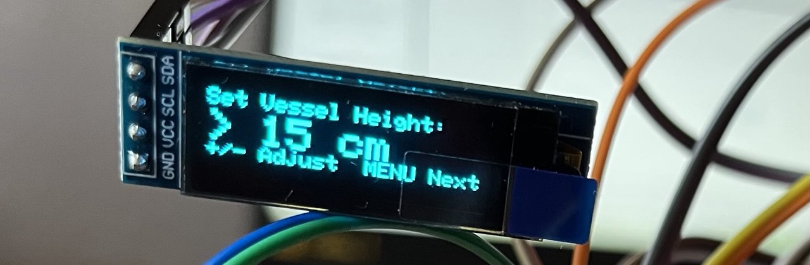
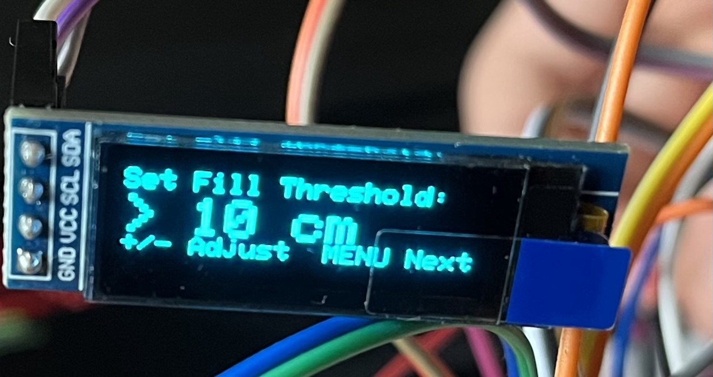
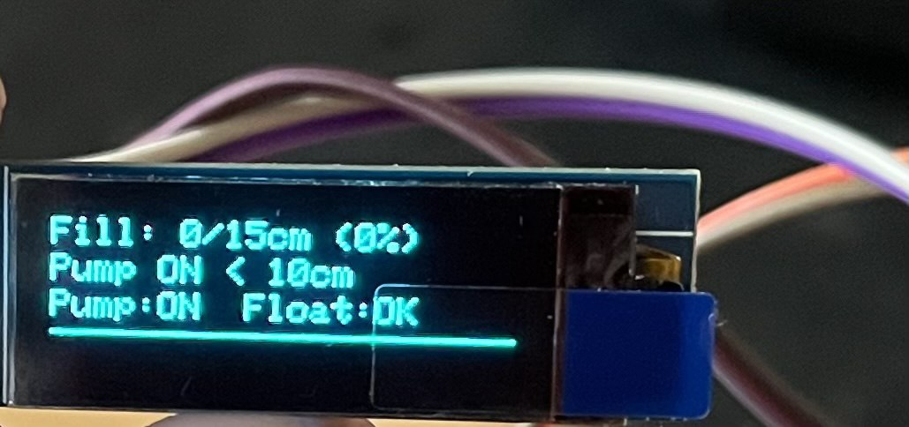
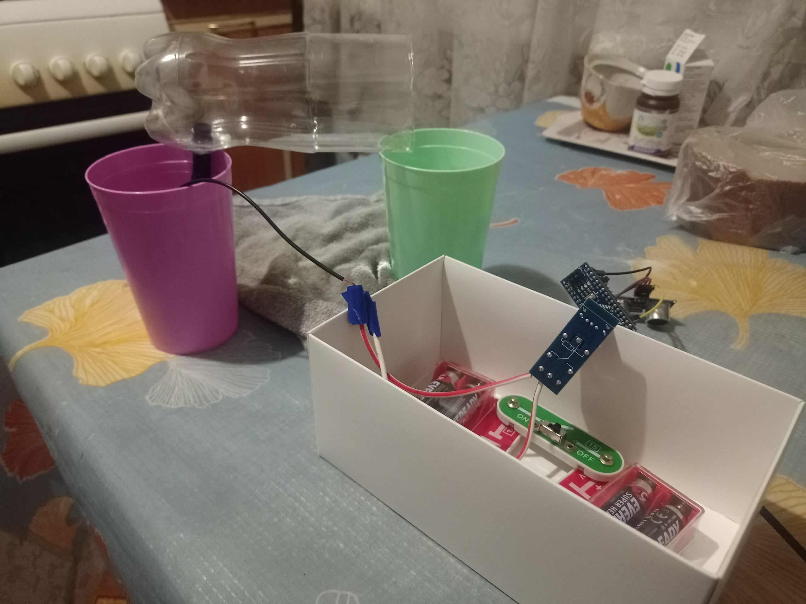

# liquid-dispenser
# Liquid Dosing System
An Arduino-based system for automated liquid dosing using an ultrasonic sensor, OLED display, and relay.

## Features
- Measures liquid level with HC-SR04 ultrasonic sensor.
- Displays real-time data on SSD1306 OLED.
- Controls a pump via a 5V relay.
- Configurable via buttons for fill threshold and vessel height.

## Demonstration
Watch the system in action:
- [Test 1](Dispenser_test1.mp4)
- [Test 2](Dispenser_test2.mp4)

## Photos
- Interface:  
    
    
  
- Prototype:  
  

## Schematic
[Download circuit diagram](circuit%20diagram.pdf)

## Components
- Arduino (e.g., Uno/Nano)
- HC-SR04 ultrasonic sensor (pins 3, 4)
- SSD1306 OLED display (I2C, pins A4, A5)
- 5V relay (pin 5)
- Push buttons (pins 6, 7, 8, 11)
- Float switch (pin 10)
- Buzzer (pin 9)

## Software Dependencies
Install via Arduino IDE Library Manager:
- [NewPing](https://bitbucket.org/teckel12/arduino-new-ping/wiki/Home)
- [Adafruit_SSD1306](https://github.com/adafruit/Adafruit_SSD1306)
- [Adafruit_GFX](https://github.com/adafruit/Adafruit-GFX-Library)
- [Bounce2](https://github.com/thomasfredericks/Bounce2)

## Setup
1. Install the libraries above.
2. Connect components as shown in the [schematic](circuit%20diagram.pdf).
3. Upload `Dispenser.ino` to your Arduino.

## Usage
- **MENU**: Enter settings mode.
- **UP/DOWN**: Adjust fill threshold or vessel height.
- **SWITCH**: Toggle dosing mode.

## Repository Structure
- `Dispenser.ino`: Arduino code.
- `Dispenser_test1.mp4`, `Dispenser_test2.mp4`: Demo videos.
- `Interface_pic1.jpg`, `Interface_pic2.jpg`, `Interface_pic3.jpg`: Interface photos.
- `Prototype.jpg`: Prototype photo.
- `circuit diagram.pdf`: Circuit diagram.
- `.gitignore`: Ignores temporary and build files.

## License
[MIT License](LICENSE)
